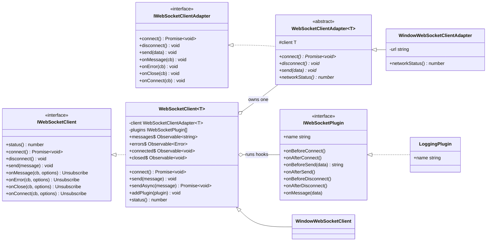
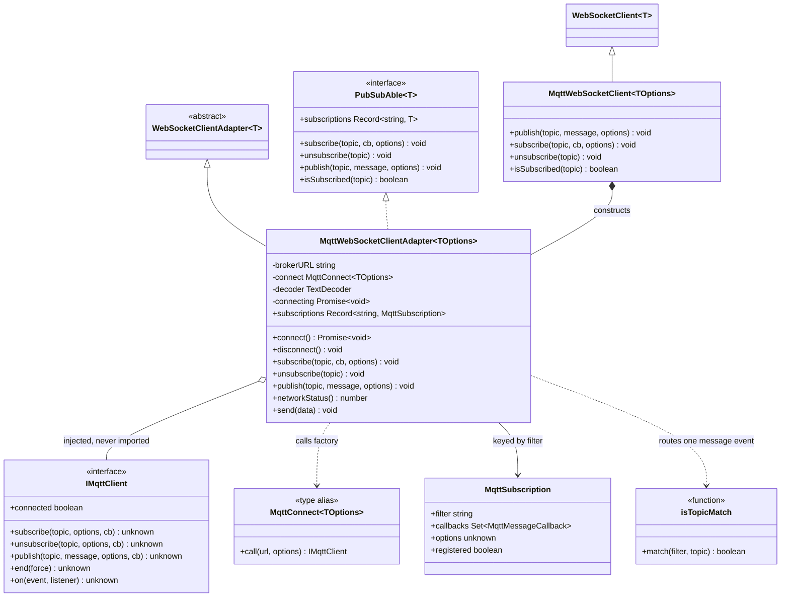
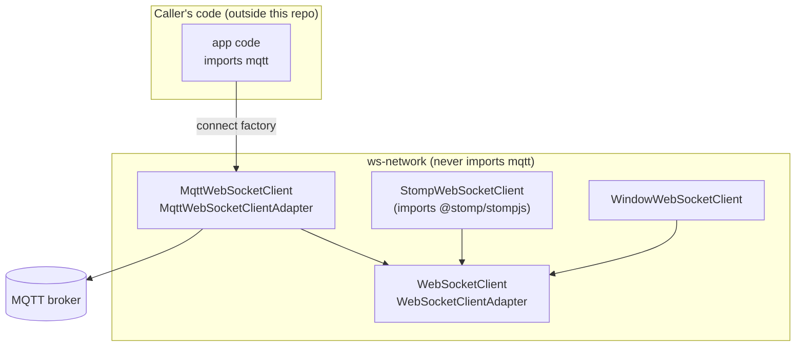
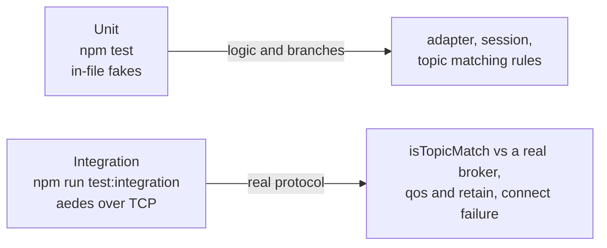

# ws-network architecture

A map for someone reading this codebase for the first time. It answers three
questions: what the layers are, who depends on whom, and where third-party
protocol libraries enter.

## The one rule that explains most of the design

`src/lib/WebSocketClient.ts` knows only about native WebSocket. Every other
protocol lives under `src/lib/protocols/<name>/` and is opt-in. A protocol
never gets imported into the native module.

MQTT goes one step further: this repo **never imports `mqtt`**. The caller
passes `mqtt.connect` in. That is the seam marked in every diagram below.

## Layer 1 — core contracts

`WebSocketClient` owns the plugin pipeline, listener registry, and RxJS
streams. `WebSocketClientAdapter` is the transport seam: one subclass per
transport or protocol.

Read `WebSocketClient.connect()` once and the pipeline is clear:
`onBeforeConnect` hooks, then the adapter's `connect()`, then `onAfterConnect`.
A protocol facade that overrides `connect()` skips all of that — which is why
the MQTT facades do not override it.

## Layer 2 — the MQTT direct path

The adapter holds the injected client. `IMqttClient` is a structural contract,
not an import: whatever the caller passes only has to have this shape.

Two things carry most of the behavior:

- **`isTopicMatch`** exists because MQTT delivers every message on a single
  `message` event. The adapter has to decide which subscription wants it.
  This is a reimplementation of broker-side matching, so the integration tier
  checks it against a real broker.
- **`MqttSubscription.registered`** exists because a subscription can be made
  before `connect()`. It is kept and registered once the connection is up.

## Where third-party libraries enter

This is the part that surprises people. The repo has no `mqtt` import.

Consequences worth knowing before you change anything:

- `mqtt` is a **devDependency** pinned to `5.14.0`, used only to type-check the
  injection contract and to run the integration and browser tiers.
- The SharedWorker entrypoint is **not** shipped by this repo. It has to import
  `mqtt`, so it belongs to the caller. `test/browser-fixture/` holds the
  reference version.
- `@stomp/stompjs` is a real runtime dependency, which is the older pattern.
  STOMP is unfinished; mirror its names, not its behavior.
- In a browser bundle `mqtt` exposes only a **default** export, so
  `mqtt.connect`, never `import { connect }`.

## The public surface is deliberately small

Entry and exit interfaces are counted and kept low. Everything else is reached
by module path, not through the barrel, so internals stay changeable.

| Barrel | Count | Names |
|--------|-------|-------|
| `protocols/mqtt/index.ts` | 6 | 2 entry pairs (adapter, convenience client) + `MqttConnect`, `IMqttClient` |
| `protocols/stomp/index.ts` | 3 | client, adapter, adapter options |

Read it as two roles:

- **Entry** — what a caller constructs. Counted in `constructor + its options`
  pairs, never as loose types. MQTT ships two pairs: the adapter (composition,
  recommended) and the convenience client.
- **Exit** — what a caller injects. For MQTT that is `MqttConnect` (the slot
  `mqtt.connect` goes into) and `IMqttClient` (the shape it must return).

Subscription records and callback aliases stay internal. The barrel was 15
names, was narrowed to 4, and settled at 6 once the adapter was re-exported on
purpose: composition is the recommended path, so the adapter has to be part of
the public surface.

## Test tiers and what each one can prove

A third tier — a real browser with a real SharedWorker — was built and then
rolled back with the MQTT worker path. It is what caught the browser build
using a default-only export, a bug the other two tiers cannot see. See
`README.md` "MQTT over a worker: not implemented" before rebuilding it.
